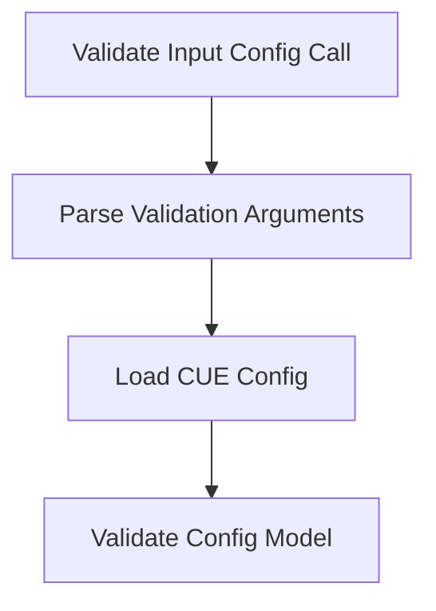

# Execution Flows

Call-oriented flows for CLI execution and validation.

## Validation flows

Graph view for validating an input config file.

### Input config validation graph

Mermaid graph for the validate-config call chain.

### Input config validation notes

#### Validate Input Config Call

Top-level CLI call flow for validating an input configuration file before any decision analysis runs.

#### Load CUE Config

Load and evaluate the CUE configuration package so the CLI works with a concrete validated config value.

#### Parse Validation Arguments

Parse CLI arguments for the validate command, including the config path and output flags.

#### Validate Config Model

Run structural and graph validation on the loaded config and emit diagnostics for any invalid references or incomplete model data.

